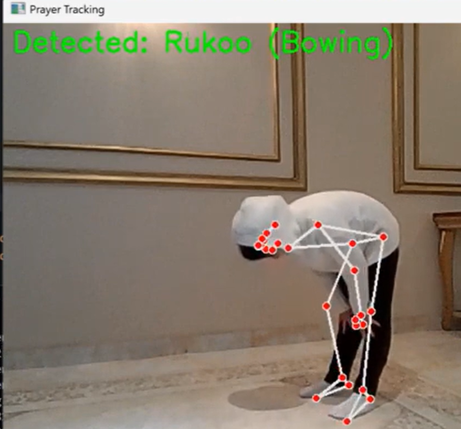
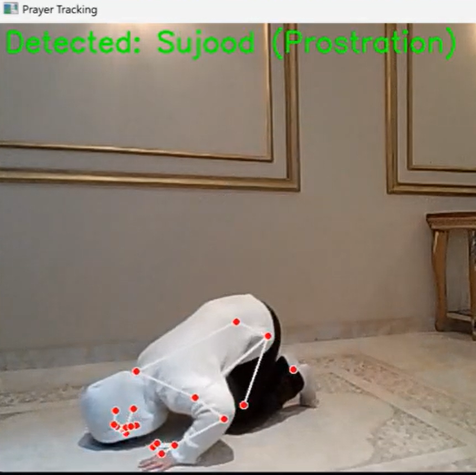
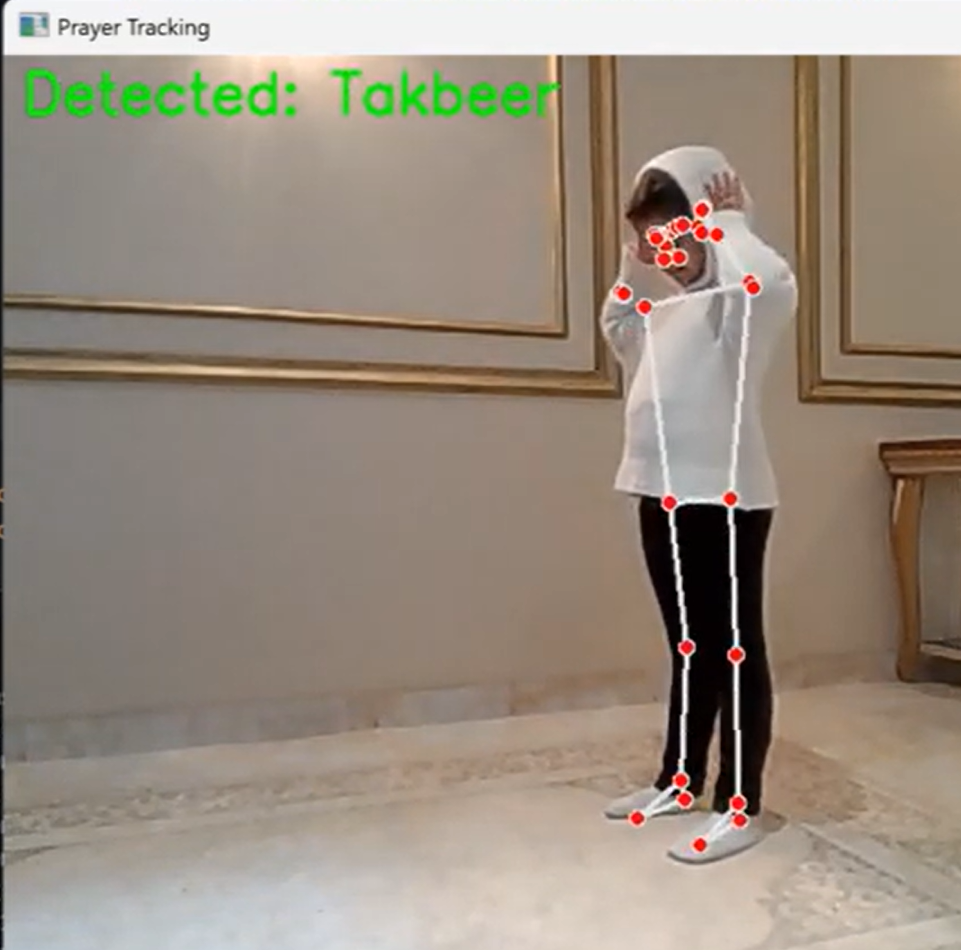

# 🕌 Faridah – Real-Time Prayer Tracking System

A real-time prayer tracking system that analyzes and evaluates Islamic prayer movements using **MediaPipe**, **computer vision**, and **speech recognition**.

---

## 🚀 Overview

Faridah is an intelligent system designed to help children learn and perform prayer correctly by tracking their movements and voice in real time.

The system detects key prayer positions such as **Takbeer**, **Standing**, **Rukoo**, and **Sujood**, and evaluates the accuracy of the performed prayer.

---

## 🎥 Demo

Watch the system in action:

👉 https://youtu.be/L6XQW_gxwac

This demo shows:

* Real-time movement tracking
* Prayer step detection
* Voice recognition for Salam
* Final accuracy calculation

---

## 🧠 Features

* Real-time prayer movement tracking using MediaPipe
* Detection of key prayer positions:

  * 🙌 Takbeer
  * 🧍 Standing
  * 🤲 Rukoo (Bowing)
  * 🧎 Sujood (Prostration)
* Speech recognition to detect "السلام عليكم ورحمة الله"
* Automatic prayer completion detection
* Accuracy calculation of performed prayer steps

---

## 📍 Detected Positions

The system detects and classifies the following prayer steps:

* Takbeer
* Standing
* Rukoo (Bowing)
* Sujood (Prostration)
* Salam (via speech recognition)

---

## ⚙️ How It Works

1. Captures video using webcam
2. Uses MediaPipe Pose to detect body landmarks
3. Analyzes body positions to classify prayer movements
4. Uses speech recognition to detect Salam
5. Compares performed steps with the correct prayer sequence
6. Outputs final accuracy score

---

## 🛠️ Tech Stack

* Python
* OpenCV
* MediaPipe
* SpeechRecognition

---

## 📊 Example Results

### 🤲 Rukoo (Bowing)



### 🧎 Sujood (Prostration)



### 🙌 Takbeer



---

## ▶️ How to Run

1. Install dependencies:

```bash
pip install -r requirements.txt
```

2. Make sure your webcam and microphone are enabled.

3. Run the system:

```bash
python main.py
```

---

## 💡 Use Cases

* Helping children learn prayer correctly
* Assisting parents in monitoring performance
* Supporting educational and religious learning tools
* Exploring real-time AI applications in human motion analysis

---

## 🔮 Future Improvements

* Improve movement detection accuracy
* Add more detailed feedback per prayer step
* Build a mobile application version
* Integrate with the Faridah mobile app

---

## 👩‍💻 Author

**Shams Abdullah Alarifi**
AI Engineer | Machine Learning | Computer Vision

---

## ⭐ If you like this project, consider giving it a star!
